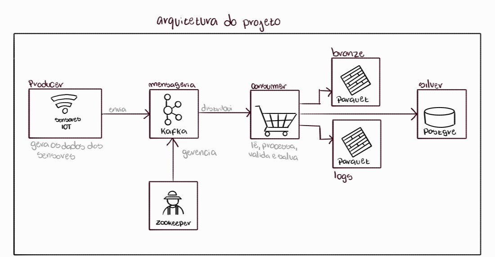

# Case Data Engineer

Este repositório contém dois assignments de Engenharia de Dados, simulando desafios reais de processamento, ingestão e transformação de dados em ambientes de Big Data, utilizando PySpark, Kafka, Docker, e PostgreSQL.

---

## Estrutura de Diretórios

```css
├── assignment-1/                             /* Dados e notebook do Assignment 1 (Databricks + PySpark) */
│ ├── info_transportes.csv 
│ └── pipeline_case_data_engineer.ipynb
│
├── assignment-2/                             
│ ├── scripts/                                /* Scripts do Assignment 2 */
│ │
│ ├── consumer/                               /* Código, Dockerfile e driver JDBC do Consumer (Spark) */
│ │ ├── Dockerfile
│ │ ├── consumer.py
│ │ └── postgresql-42.7.3.jar
│ │
│ ├── data/                                   
│ │ ├── bronze/                               /* Dados brutos lidos do Kafka, salvos em Parquet */
│ │ │ ├── _spark_metadata
│ │ │ ├── part-00000-.parquet
│ │ │ └── ...
│ │ └── logs/                                 /* Dados inválidos (simulação de erros), também em Parquet */
│ │ ├── _spark_metadata
│ │ ├── part-00000-.parquet
│ │ └── ...
│ │
│ ├── db-init/                                /* Script SQL para criação da tabela no PostgreSQL */
│ │ └── init.sql
│ │
│ ├── producer/                               /* Código e Dockerfile do Producer (simulador de sensores IoT) */
│ │ ├── Dockerfile
│ │ └── producer.py
│ │
│ ├── docker-compose.yml                      /* Orquestração dos serviços */
│ └── testes.ipynb                            /* Notebook para consulta/exploração das saídas */
│
├── README.md
└── arq.jpg
```

---

## Escolha das Tecnologias

- **PySpark**: Processamento eficiente de grandes volumes de dados, fácil integração com outros componentes do ecossistema Big Data.
- **Kafka**: Mensageria em tempo real, garantindo escalabilidade e desacoplamento entre ingestion (Producer) e processamento (Consumer).
- **Docker / Docker Compose**: Criação de ambientes reprodutíveis, simples e portáteis, facilitando testes e deployment local.
- **PostgreSQL**: Banco relacional robusto e fácil de integrar via JDBC com Spark para a camada silver (dados tratados).
- **Faker**: Geração de dados simulados para o cenário IoT.
- **Parquet**: Formato colunar otimizado para armazenar grandes volumes de dados de forma compacta e eficiente.

# Assignment 1 

Solução desenvolvida em PySpark para processamento e agregação de dados.

---

## **Como executar o projeto no Databricks Community Edition**

### 1. Faça upload dos dados

- No menu à esquerda, clique em **New**
- Clique em **Add or Upload Data** > **Upload files to a volume** > **All** > **default**
- Crie um volume com o nome "assignment-1"
- Faça upload do arquivo **info_transportes.csv**  
  - Caminho típico: `/Volumes/workspace/default/assignment-1/info_transportes.csv`

### 3. Importe e execute o notebook

- Importe o notebook `pipeline_case_data_engineer.ipynb` para seu workspace Databricks
  - (Use o arquivo .ipynb disponível neste repositório, na pasta "assignment-1")

### 4. Saída esperada

- Tabela agregada `info_corridas_do_dia`.
  
## Acesse o notebook no Databricks

Você pode visualizar ou clonar o notebook diretamente pela plataforma Databricks:

[Clique aqui para abrir o notebook no Databricks](https://dbc-dbfffb09-9678.cloud.databricks.com/editor/notebooks/2929827828570792?o=3068775036321311)

---

# Assignment 2

Pipeline para ingestão, validação e armazenamento de dados de sensores IoT, utilizando Kafka, Spark e PostgreSQL com deployment via Docker Compose.



- **Producer:** Gera e envia dados de sensores falsos para o Kafka.
- **Consumer (Spark):** Consome do Kafka, valida, salva bronze/logs em Parquet e envia dados válidos (silver) para o PostgreSQL.
- **Infraestrutura:** Orquestrada com Docker Compose.

---

## Como executar o projeto

### 1. Pré-requisitos

- Docker instalado

### 2. Clone o repositório

```bash
git clone https://github.com/lealellen/case-data-engineer.git
cd case-data-engineer
cd assignment-2
cd scripts
```

### 3. Build e execução dos containers

```bash
docker compose up
```

### 4. Saídas

Serão gerados arquivos parquet em data/bronze e data/logs

- data/bronze: Dados brutos, salvos após o envio pelo Kafka
- data/logs: Dados com campos inválidos (Simulando dados corrompidos). 

A camada silver é salva em um banco de dados Postgre. 

Para visualizar os dados das camadas basta executar o notebook **testes.ipynb**

### 5. Observações

- Após a execução local, mantive os dados gerados na pasta assignment-2/scripts (após execução) para eventuais consultas das saídas sem a necessidade de execução.
- Os arquivos parquet da camada bronze e logs são gerados são gerados localmente mas em um cenario de ambiente produtivo um Bucket S3 seria ideal para armazenamento.
